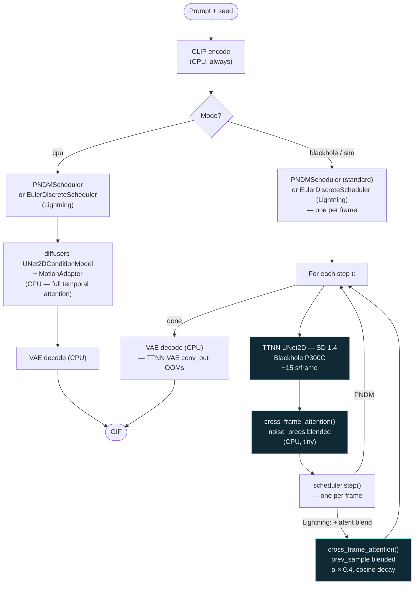
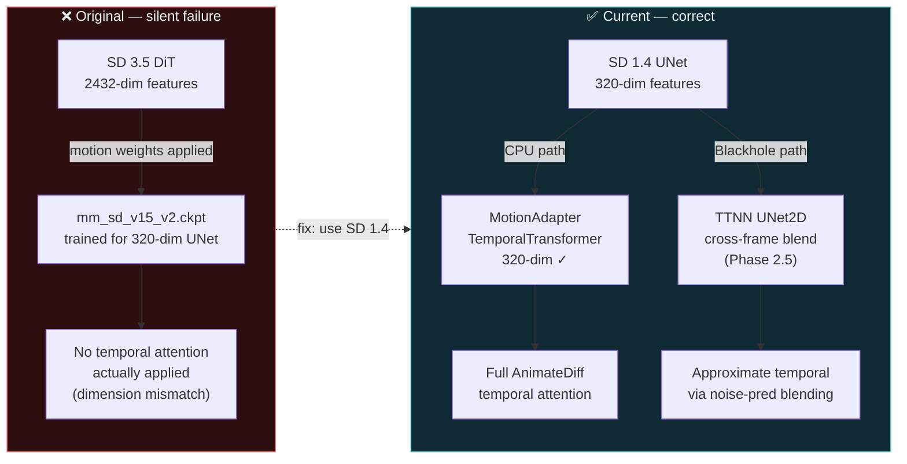

# AnimateDiff on Tenstorrent Hardware

Two-phase implementation: **Phase 1** generates real, temporally coherent video
on CPU using the correct AnimateDiff architecture. **Phase 2** accelerates spatial
denoising on Blackhole hardware using the TTNN UNet.

---

## Gallery

### Blackhole (P300C) — 8 frames × 25 steps, ~15 s/frame

| *"World of Tomorrow"* | *"Phosphor Horizon"* | *"Mayan Temple"* |
|---|---|---|
|  |  |  |

| *"Neon Dystopia"* | *"Ocean"* |
|---|---|
|  |  |

### AnimateDiff-Lightning on Blackhole — 8 frames × 25 steps, Euler · CFG=7.5

Lightning mode runs the TTNN UNet with `EulerDiscreteScheduler` (trailing, linear).
On Blackhole the base SD 1.4 TTNN UNet is used — CFG=7.5 retained for full guidance.
Same step count (25) as standard PNDM, different solver.

See the [full 10-prompt gallery](https://tenstorrent.github.io/tt-animatediff/gallery.html) for standard vs Lightning side-by-side.

| *"Aurora"* | *"Mandala"* | *"Mycelium"* |
|---|---|---|
|  |  |  |

---

## Quick Start

```bash
pip install -r requirements.txt
hf download CompVis/stable-diffusion-v1-4
hf download guoyww/animatediff-motion-adapter-v1-5-2

# CPU — any machine, no hardware required
python examples/generate.py --mode cpu --prompt "ocean waves at sunset, cinematic"

# Blackhole hardware (default, ~15 s/frame)
source ~/tt-metal/python_env/bin/activate
python examples/generate.py --prompt "aurora borealis over a frozen lake, cinematic 4K"

# Blackhole + Lightning (Euler scheduler, 25 steps, CFG=7.5)
python examples/generate.py --lightning

# CPU + Lightning (~20 s/frame, 4-step distilled adapter, no hardware required)
python examples/generate.py --mode cpu --lightning --lightning-steps 4

# Simulator — no hardware, bit-exact Blackhole
python examples/generate.py --mode sim --frames 2 --steps 4
```

---

## Gradio UI

Launch a web interface for point-and-click generation.

### Local — Blackhole hardware

```bash
pip install -e ".[ui]"
source ~/tt-metal/python_env/bin/activate
python app.py
# Open http://localhost:7860
```

Models are cached across generations — only the first run pays the load cost
(~7 s) and kernel compilation (~2–3 min, cached after first run).

### Local — CPU only (no hardware)

```bash
pip install -e ".[ui]"
python app.py
# Switch mode to "cpu" in the UI dropdown
```

### Local — ttsim simulator (no hardware)

```bash
mkdir -p ~/sim
wget -O ~/sim/libttsim_bh.so \
    https://github.com/tenstorrent/ttsim/releases/download/v1.7.0/libttsim_bh.so

pip install -e ".[ui]"
source ~/tt-metal/python_env/bin/activate
python app.py
# Switch mode to "sim" in the UI, set sim binary path if needed
```

### HuggingFace Spaces

Also available at [huggingface.co/spaces/tenstorrent/tt-animatediff](https://huggingface.co/spaces/tenstorrent/tt-animatediff) — runs on ttsim, no hardware required.

To self-host:

1. Create a new Space (SDK: Gradio)
2. Copy `spaces/` contents into the Space repo root
3. Copy `app.py` and `animatediff_ttnn/` into the Space repo root
4. The Space picks up `SPACE_MODE=sim` automatically

Note: ttsim requires a Linux x86\_64 runner. Upload `libttsim_bh.so` as a Space
file or add a setup script to download it at startup.

### UI Parameters

| Parameter | Range | Default | Notes |
|---|---|---|---|
| Mode | cpu / blackhole / sim | blackhole | sim on HF Spaces |
| Prompt | text | — | See [Prompt Guide](#prompt-guide) |
| Negative prompt | text | standard exclusions | |
| Frames | 2–24 | 8 | 2–4 recommended for sim |
| Steps | 4–50 | 25 | 4 for Lightning / sim |
| Seed | integer | 42 | |
| Temporal alpha | 0.0–1.0 | 0.35 | Blackhole/sim only |
| Lightning | checkbox | off | Euler solver on Blackhole/sim (same steps, different trajectory); ~6× faster on CPU |
| Sim binary path | file path | ~/sim/libttsim_bh.so | sim mode only |

---

## Modes Reference

| Mode | Hardware | Speed | Temporal attention |
|---|---|---|---|
| `cpu` | None | ~2 min/frame | Full AnimateDiff MotionAdapter ✓ |
| `cpu --lightning` | None | ~20 s/frame | Full AnimateDiff MotionAdapter ✓ |
| `blackhole` | Blackhole P100/P300C | ~15 s/frame (25 steps, PNDM) | Cross-frame blend (temporal-alpha) |
| `blackhole --lightning` | Blackhole P100/P300C | ~15 s/frame (25 steps, Euler) | Cross-frame blend (temporal-alpha) |
| `sim` | None (ttsim) | ~10–100× slower than silicon | Cross-frame blend (temporal-alpha) |

Both standard and Lightning on Blackhole use 25 steps and CFG=7.5 with the base SD 1.4 TTNN UNet.
Lightning uses `EulerDiscreteScheduler` (trailing, linear) rather than `PNDMScheduler` — a different solver trajectory, not fewer steps.
CPU Lightning (`--mode cpu --lightning`) uses the real 4-step distilled adapter (CFG=1.0 baked in) and is genuinely ~6× faster than CPU standard.

---

## No Hardware? Use the Simulator

[ttsim](https://github.com/tenstorrent/ttsim) is a bit-exact Blackhole simulator
that runs on any Linux/x86\_64 machine. See [docs/SIMULATOR.md](docs/SIMULATOR.md)
for full setup. Quick start:

```bash
python examples/generate.py --mode sim --frames 2 --steps 4
python examples/generate.py --mode sim --sim ~/sim/libttsim_bh.so --frames 2 --steps 4
```

---

## Implementation Status

| Phase | Status | Notes |
|---|---|---|
| Phase 1 — CPU baseline | ✅ Complete | `diffusers.AnimateDiffPipeline` + MotionAdapter |
| Phase 1 — Lightning (CPU) | ✅ Complete | `ByteDance/AnimateDiff-Lightning`, ~20 s/frame |
| Phase 2.5 — Lightning (Blackhole) | ✅ Complete | `TtEulerScheduler`, Euler solver · 25 steps · CFG=7.5 |
| Phase 2 — Blackhole denoising | ✅ Code complete | TTNN UNet, hardware validation ongoing |
| Phase 2.5 — Cross-frame temporal | ✅ Complete | `--temporal-alpha` blend during denoising |
| Phase 3 — Full TTNN temporal attention | 🔲 Future | Requires TemporalTransformer in TTNN UNet |
| Gradio UI | ✅ Complete | Local + HF Spaces, Lightning support |

For full details see [docs/IMPLEMENTATION_STATUS.md](docs/IMPLEMENTATION_STATUS.md).

### Why not full AnimateDiff temporal attention on Blackhole yet?

The `mm_sd_v15_v2.ckpt` motion weights were trained for SD 1.5's UNet at 320-dim features.
The TTNN UNet (`UNet2D` from tt-metal SD 1.4 demo) does not currently have
`TemporalTransformer` blocks — adding them would require modifying tt-metal source.
Phase 2.5 works around this with cross-frame self-attention blending (`--temporal-alpha`).
Full integration is tracked as Phase 3.

---

## Code Structure

```
animatediff_ttnn/
  pipeline.py             Phase 1: thin wrapper around diffusers AnimateDiffPipeline
  ttnn_pipeline.py        Phase 2/2.5: TTNN UNet frame generation on Blackhole
  temporal_attention.py   Phase 2.5: cross-frame self-attention at each denoising step
  tt_euler_scheduler.py   TtEulerScheduler — Euler wrapper for Lightning on Blackhole
  generation_helpers.py   Shared load_sd14_ttnn / encode_prompt (no arg-parse side effects)
  temporal_module.py      Reference — temporal attention math (kept for study)
  __init__.py             Exports Phase 1 public API

examples/
  generate.py              Unified entry point (--mode cpu|blackhole|sim; default blackhole)
  generate_baseline.py     Phase 1 CPU (diffusers AnimateDiffPipeline, any machine)
  generate_blackhole.py    → shim to generate.py --mode blackhole
  generate_blackhole_v2.py → shim to generate.py --mode blackhole
  generate_sim.py          → shim to generate.py --mode sim

app.py                     Gradio UI (local + HF Spaces)
spaces/                    HuggingFace Spaces deployment files

tests/
  test_pipeline.py            Phase 1 unit tests
  test_ttnn_pipeline.py       Phase 2 unit tests (hardware-mocked)
  test_tt_euler_scheduler.py  TtEulerScheduler unit tests
  test_temporal_attention.py  Cross-frame attention unit tests
  test_app.py                 Gradio UI smoke tests

docs/
  IMPLEMENTATION_STATUS.md  Current phase status
  INTEGRATION_GUIDE.md      Consuming this repo from downstream projects
  SIMULATOR.md              ttsim setup and usage
  UI.md                     Gradio UI full documentation
```

---

## Prompt Guide

This pipeline runs **SD 1.4 + MotionAdapter** (Phase 1/CPU) or
**SD 1.4 + TTNN UNet** (Phase 2/Blackhole). Both use SD 1.4 — knowing
its characteristics helps write prompts that land.

### Model pedigree

| Property | Value |
|---|---|
| Base model | CompVis/stable-diffusion-v1-4 (2022) |
| Resolution | 512 × 512 native |
| CLIP text encoder | ViT-L/14, 77-token max |
| Temporal coherence (cpu) | Full AnimateDiff MotionAdapter |
| Temporal coherence (blackhole/sim) | Cross-frame blend (`--temporal-alpha`, default 0.35) |

### What SD 1.4 does well

- **Natural scenes:** forests, mountains, oceans, sky, fire, water
- **Painterly / artistic styles:** oil painting, watercolor, impressionism, concept art
- **Cinematic lighting:** golden hour, neon, moonlight, candlelight, dramatic shadows
- **Architecture:** temples, ruins, castles, sci-fi structures
- **Cosmic / abstract:** nebulae, galaxies, aurora, energy fields, geometric patterns
- **Retro aesthetics:** CRT glow, vintage film grain, vaporwave, cyberpunk

### What to avoid

- **Photorealistic people / faces** — anatomy drifts frame-to-frame
- **Text in the image** — SD 1.4 cannot render legible text
- **Prompts over ~60 words** — CLIP truncates at 77 tokens

### Prompt patterns that work

```
# Style before subject
"watercolor painting of ancient ruins at sunset, soft brushstrokes, muted palette"

# Cinematic lighting descriptors
"cinematic 4K, dramatic side lighting, volumetric fog, depth of field"

# Motion-friendly subjects
"crackling campfire", "ocean waves", "swirling clouds", "aurora borealis",
"shifting cosmos", "flowing lava", "drifting smoke", "mycelium network pulsing"
```

### `--temporal-alpha` tuning (Blackhole/sim)

| Value | Effect |
|---|---|
| `0.0` | No cross-frame mixing — frames denoised independently |
| `0.2–0.3` | Subtle coherence, slight variation frame-to-frame |
| `0.35` | **Default** — good balance for most subjects |
| `0.5–0.7` | Strong coherence; background stabilizes, detail may flatten |
| `1.0` | Maximum blending — frames very similar, low motion |

Fast motion (fire, water): `0.2–0.35`. Slow drift (cosmos, aurora): `0.4–0.6`.

### `--steps` vs quality

| Mode | Minimum | Sweet spot | Notes |
|---|---|---|---|
| PNDM (standard, blackhole/sim) | 4 (preview/sim) | 25 on silicon | Diminishing returns beyond 30 |
| Euler (Lightning, blackhole/sim) | 4 (preview/sim) | **25** | Base TTNN UNet — same CFG=7.5, different solver |
| Euler (Lightning, cpu) | 2 | **4** | Real distilled adapter — CFG=1.0 baked in; more steps degrades |

CPU Lightning `--lightning-steps` must match the distillation checkpoint (2, 4, or 8).
Blackhole/sim Lightning ignores `--lightning-steps` and uses `--steps` (default 25).

---

## Execution Flow



## Architecture Reference: Original vs Current

The original implementation used architecturally incompatible components:



Full AnimateDiff on Blackhole (Phase 3) requires TemporalTransformer layers
inserted into the TTNN UNet transformer blocks — tracked as future work.

---

## Testing

```bash
pip install pytest
python -m pytest tests/ -v
```

All tests mock hardware dependencies and run on any machine.

---

## Integration

For guidance on consuming this project from other repos — as a toolkit lesson,
application plugin, or Python library — see
[docs/INTEGRATION_GUIDE.md](docs/INTEGRATION_GUIDE.md).

---

## Changelog

### v0.5.0 — 2026-06-07
- **Lightning CFG fix** — Blackhole/sim Lightning path now uses CFG=7.5 (was incorrectly 1.0); CFG=1.0 only applies to the real distilled CPU adapter
- **10-prompt comparison gallery** — [gallery.html](https://tenstorrent.github.io/tt-animatediff/gallery.html): standard PNDM vs Euler Lightning, all prompts, 25 steps each
- **`app.py` bug fix** — Gradio UI Blackhole/sim path now passes `guidance_scale=7.5` for Lightning
- Gallery labels and README/index corrected throughout

### v0.4.0 — 2026-06-07
- **Lightning on Blackhole** — `--lightning` now works in all modes (blackhole, sim, cpu)
- `TtEulerScheduler` — wraps `EulerDiscreteScheduler` for `build_tlist()` compatibility
- Measured **~4.3 s/frame** on P300C (8 frames, 4 steps) vs ~15 s/frame standard
- Lightning GIF examples regenerated on real Blackhole hardware
- `TtEulerScheduler` unit tests (13 tests, all modes verified)

### v0.3.0 — 2026-06-06
- **Gradio UI** (`app.py`) — local launch and HuggingFace Spaces deployment
- **AnimateDiff-Lightning** support — `--lightning` flag for CPU generation
- HuggingFace Space files in `spaces/`
- UI smoke tests (`tests/test_app.py`)
- Gradio 6 compatibility fix (theme outside Blocks constructor)

### v0.2.0 — 2026-05-14
- **Phase 2.5** — cross-frame temporal attention blend (`--temporal-alpha`)
- Unified entry point `examples/generate.py` with `--mode cpu|blackhole|sim`
- ttsim simulator support (`--mode sim`)
- `generate_sim.py`, `generate_blackhole.py`, `generate_blackhole_v2.py` shims
- Public release compliance report, SECURITY.md, CODE_OF_CONDUCT.md
- Hardware compatibility docs (`HARDWARE_COMPAT.md`)

### v0.1.0 — 2026-05-07
- Initial public release
- Phase 1: CPU AnimateDiff baseline (`diffusers.AnimateDiffPipeline` + MotionAdapter)
- Phase 2: Blackhole TTNN UNet frame generation
- `temporal_module.py` reference implementation
- Repository scaffolding: CI, tests, integration guide, simulator docs

---

## Background: Why the Previous Implementation Was Wrong

The original implementation applied `mm_sd_v15_v2.ckpt` motion weights to SD 3.5's
DiT transformer (2432-dim features). These weights were trained for SD 1.5's UNet
(320-dim features). They are architecturally incompatible — no temporal attention was
actually being applied.

The fix: use **SD 1.4 UNet + MotionAdapter**, where temporal attention is injected at
the 320-dim level that the motion weights expect.

---

## Contributing

See [CONTRIBUTING.md](CONTRIBUTING.md). PRs reviewed weekly.

---

## License

**Overall:** [Apache License 2.0](LICENSE) — see [LICENSE_understanding.txt](LICENSE_understanding.txt).

**Third-party dependencies:** [NOTICE](NOTICE).
