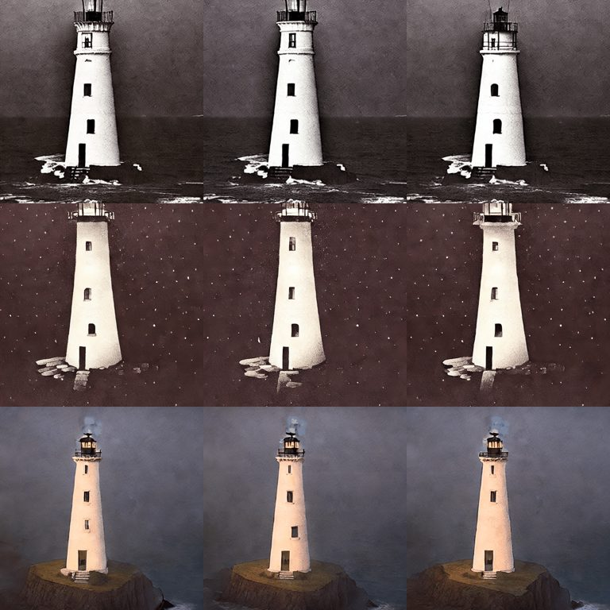
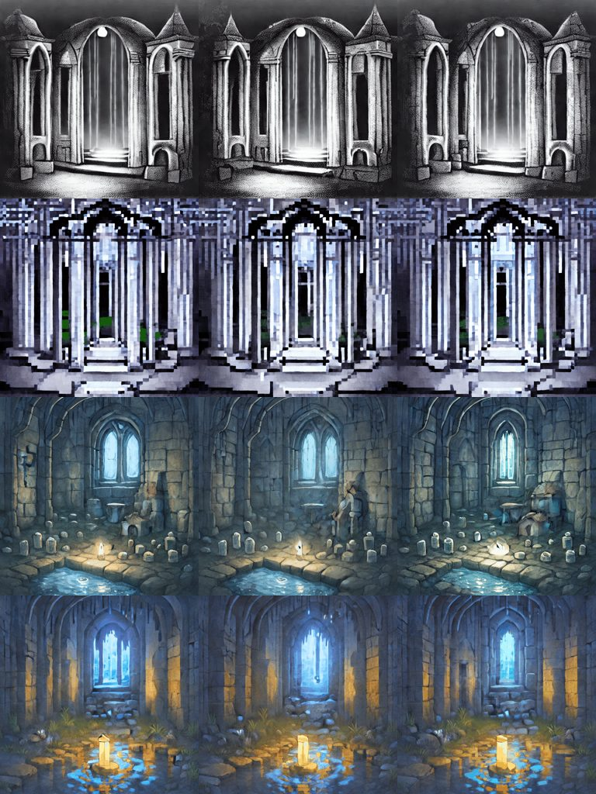

# LoRA support

`examples/generate.py --lora` merges a Stable Diffusion style LoRA into the model before it
goes to the device. The Blackhole runs the ordinary SD UNet with different numbers in it.
Merging costs under a second at load and nothing per frame.

```bash
python examples/generate.py --prompt "storybook anime illustration, a moonlit crypt" \
  --lora "neonforestmist/sd15-storybook-anime-lora:storybook_anime_lora.safetensors@0.85"
```

`--lora SOURCE[:FILE][@SCALE]` can be repeated to stack LoRAs. `SOURCE` is a Hub repo id or a
local path. `FILE` names the `.safetensors` file inside the repo and is required for Hub repos.
`SCALE` defaults to 1.0. Python entry point: `animatediff_ttnn.lora.merge_loras`.

## How it works

The TTNN UNet is built from a CPU `UNet2DConditionModel` by `preprocess_model_parameters`.
`load_sd14_ttnn(device, loras=...)` folds each LoRA into that CPU model first, so
`W' = W + scale * (alpha / rank) * (up @ down)` is baked into the weights the device receives.
The UNet half goes through diffusers' kohya converter. The text-encoder half
(`lora_te_*` keys) is merged by `lora._merge_text_encoder`, because diffusers' own text-encoder
loader finds no matching modules on the transformers 5.x CLIP layout.

## What loads and what does not

| Kind | Loads? | Why |
|---|---|---|
| SD 1.x style LoRA, kohya format (`lora_unet_*`, `lora_te_*`) | Yes | Same layers as the SD 1.4 UNet and CLIP encoder. |
| LoRA for another base model (SDXL, Flux, Krea-2) | No. `merge_loras` raises `ValueError` | Diffusers loads the file but matches no UNet weight. The check for "changed nothing" exists because that outcome otherwise looks like success. |
| `guoyww/animatediff-motion-lora-*` (zoom, pan, tilt, roll) | Not supported | These patch the MotionAdapter's motion modules and do not touch the SD UNet. They need a separate merge into the motion adapter, which this change does not do. |

SD 1.5 LoRAs are applied to SD 1.4 weights, which is this repo's base. The layer shapes are
identical so the merge succeeds, and the three results below look as intended.

## Hardware results (2026-10-07, one Blackhole chip of a P300c pair)

8 frames, 20 steps, 512x512, seed fixed per prompt, `--device-id 0`. Every run in a row
shares prompt and seed with its baseline.

| Run | LoRA tensors merged (UNet + text encoder) | Model load | Denoise, 8 frames |
|---|---|---|---|
| Lighthouse, baseline | none | 8.0 s | 123.7 s (cold kernel compile after a chip reset) |
| Lighthouse, pixel art @1.0 | 192 + 0 | 6.2 s | 19.8 s |
| Lighthouse, storybook anime @1.0 | 192 + 72 | 6.5 s | 18.5 s |
| Crypt, baseline | none | 5.5 s | 18.4 s |
| Crypt, pixel art @1.0 | 192 + 0 | 6.2 s | 18.5 s |
| Crypt, storybook anime @0.85 | 192 + 72 | 6.3 s | 18.2 s |
| Crypt, anime @0.85 + pixel art @0.6 | 384 + 72 | 7.5 s | 18.3 s |

Warm denoise time is 2.3 to 2.5 s per frame with or without a LoRA. The 123.7 s baseline is
the first run after a chip reset and includes kernel compilation; it says nothing about LoRAs.
These are single runs, so differences of a few tenths of a second are within noise.

Observations:

* Pixel art changes the palette and edges strongly even without its trigger phrase.
* Storybook anime at 1.0 without its trigger phrase gives a warm, painterly look. At 0.85 with the
  trigger phrase the crypt becomes an illustrated dungeon with a lit candle. The author recommends 0.75 to 0.95.
* Stacking works. The stacked crypt differs from both single-LoRA crypts: it keeps the anime
  lighting and picks up the pixel-art LoRA's blocky floor and water.
* The figures in the prompts ("a pale figure waving", "a hooded figure holding a lantern") do not
  appear in any run, with or without a LoRA. SD 1.4 does not render them reliably; LoRAs do not fix that.

### Lighthouse: baseline, pixel art, storybook anime (top to bottom)

Prompt: *a candlelit abandoned lighthouse on black cliffs, thick fog creeping over the sea, a
pale figure waving from the highest window, eerie, mysterious, midnight*. Seed 1313.



### Crypt: baseline, pixel art, storybook anime, both stacked (top to bottom)

Prompt: *a moonlit crypt beneath a drowned chapel, a hooded figure holding a single lantern,
whispering shadows gathering along the walls, ghostly mist, ancient runes glowing faintly,
haunting, mysterious*, with each LoRA's trigger phrase in front ("Pixel Art, ",
"storybook anime illustration, "). Seed 666.



Each image shows frames 1, 4 and 8 of the 8-frame GIF. With the default Phase 2.5 path the
frames differ little from each other.

## Limits and caveats

* **Single process, CLI only.** `--lora` is wired into `examples/generate.py`. The served path
  (`tt-model serve`, `session.ensure_blackhole`) does not take LoRAs yet.
* **Not pinned.** A LoRA repo you name is downloaded at its default branch (`revision_for` returns
  `None` for repos this package does not pin). Only `.safetensors` files are read.
* **Merged weights are not cached.** Each run re-merges. At under a second this does not need a cache.
* **Validated on diffusers 0.39 and peft 0.21.** `requirements.txt` still allows diffusers 0.32.1;
  the merge uses `unet.fuse_lora` and `unet.unload_lora`, which were not tried there.
* **Licenses.** The pixel art LoRA is `license:other`, the anime LoRA is CreativeML OpenRAIL-M, and the
  Krea-2 LoRA (which does not load) is `license:other`. Check each before redistributing output.

## Reproduce

```bash
gozer run --chips 1 --who "claude:lora" --reason "lora demo" -- \
  python examples/generate.py --device-id 0 --frames 8 --steps 20 --seed 666 \
  --prompt "Pixel Art, a moonlit crypt beneath a drowned chapel, ghostly mist, haunting" \
  --lora "artificialguybr/pixelartredmond-1-5v-pixel-art-loras-for-sd-1-5:PixelArtRedmond15V-PixelArt-PIXARFK.safetensors"
```

Open one device per process. Launching three at once failed in firmware init
(`risc_firmware_initializer`) and left the chips needing a reset.
